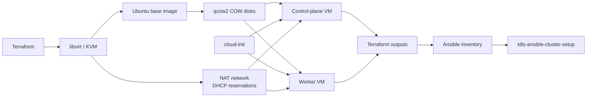

# Kubernetes Homelab Infrastructure on Libvirt

[](https://github.com/edimatt/k8s-terraform-cluster-setup/actions/workflows/terraform-ci.yml)

Terraform infrastructure for the virtual-machine layer of my Kubernetes homelab.

The project provisions one control-plane VM and one worker VM on KVM/libvirt, using Ubuntu cloud images, copy-on-write qcow2 disks, cloud-init, and a dedicated NAT network with deterministic node addresses.

Terraform stops at SSH-ready Ubuntu nodes. Kubernetes installation and platform configuration are handled by the companion [`k8s-ansible-cluster-setup`](https://github.com/edimatt/k8s-ansible-cluster-setup) repository.

## Demo


## Architecture



The responsibility boundary is deliberate:

* **Terraform** owns virtual infrastructure, storage, networking, VM identity, cloud-init, and infrastructure outputs.
* **Ansible** owns operating-system configuration, Kubernetes bootstrap, platform services, security controls, and cluster validation.

Node definitions exist in Terraform only. The Ansible inventory is generated from Terraform outputs instead of maintaining a second list of hosts.

## Network design

The lab uses a dedicated libvirt NAT network:

| Purpose           | Address or range                    |
| ----------------- | ----------------------------------- |
| Network           | `192.168.125.0/24`                  |
| Gateway           | `192.168.125.1`                     |
| Control plane     | `192.168.125.10`                    |
| Worker            | `192.168.125.11`                    |
| Dynamic DHCP pool | `192.168.125.100`–`192.168.125.254` |

Each VM receives a fixed MAC address and a matching DHCP reservation:

```text
control_plane: 52:54:00:12:34:56 → 192.168.125.10
worker:        52:54:00:12:34:57 → 192.168.125.11
```

The guests still use DHCP, but their addresses remain deterministic across VM recreation. This keeps SSH and Ansible targeting predictable without hardcoding static network configuration inside the guests.

Terraform validates that node names, MAC addresses, and reserved IPs are unique and that reservations remain outside the dynamic DHCP pool.

## Prerequisites

* x86_64 Linux host with hardware virtualization
* QEMU/KVM and libvirt
* Existing `default` libvirt storage pool
* Permission to connect to `qemu:///system`
* Terraform 1.7+
* `jq`
* SSH public key

The default VM configuration expects OVMF at:

```text
/usr/share/edk2/ovmf/OVMF_CODE.fd
```

Adjust `main.tf` if your distribution installs it elsewhere.

## Quick start

Create the local configuration:

```bash
cp terraform.tfvars.example terraform.tfvars
```

Review it, then provision the lab:

```bash
terraform init
terraform plan
terraform apply
```

Wait until both nodes are reachable over SSH:

```bash
just ssh-test
```

If needed, override the SSH identity:

```bash
SSH_KEY=~/.ssh/id_ed25519 SSH_USER=ubuntu just ssh-test
```

Print the generated Ansible inventory:

```bash
terraform output -raw ansible_inventory
```

or export it for use by the companion repository:

```bash
terraform output -raw ansible_inventory > hosts.ini
```

Inspect all outputs:

```bash
terraform output
```

Destroy the lab when finished:

```bash
terraform destroy
```

## Configuration

| Variable                    | Default                        | Purpose                                     |
| --------------------------- | ------------------------------ | ------------------------------------------- |
| `libvirt_uri`               | `qemu:///system`               | Libvirt connection URI                      |
| `vm_name`                   | `k8s-control-01`               | Control-plane domain and volume name prefix |
| `vm_user`                   | `edoardo`                      | Administrator created by cloud-init         |
| `vm_vcpus`                  | `2`                            | Control-plane virtual CPU count             |
| `vm_memory_mb`              | `4096`                         | Control-plane memory in MiB                 |
| `root_disk_size_gib`        | `40`                           | Control-plane root disk capacity in GiB     |
| `worker_name`               | `k8s-worker-01`                | Worker domain and volume name prefix        |
| `worker_vcpus`              | `2`                            | Worker virtual CPU count                    |
| `worker_memory_mb`          | `4096`                         | Worker memory in MiB                        |
| `worker_root_disk_size_gib` | `40`                           | Worker root disk capacity in GiB            |
| `libvirt_pool`              | `default`                      | Existing storage pool                       |
| `libvirt_network`           | `k8s-lab`                      | Dedicated network name                      |
| `libvirt_network_cidr`      | `192.168.125.0/24`             | Dedicated network subnet                    |
| `libvirt_dhcp_start_host`   | `100`                          | Dynamic DHCP pool start host                |
| `libvirt_dhcp_end_host`     | `254`                          | Dynamic DHCP pool end host                  |
| `mac_address`               | `52:54:00:12:34:56`            | Stable control-plane network identity       |
| `control_plane_ip_host`     | `10`                           | Reserved control-plane host number          |
| `worker_mac_address`        | `52:54:00:12:34:57`            | Stable worker network identity              |
| `worker_ip_host`            | `11`                           | Reserved worker host number                 |
| `image_url`                 | Ubuntu 26.04 amd64 cloud image | Base operating-system image                 |
| `ssh_public_key_path`       | `~/.ssh/eagle_ed25519.pub`     | Public key installed in the VM              |

See [`terraform.tfvars.example`](terraform.tfvars.example) for the local configuration template.

## Testing and CI

Run the same checks used by CI:

```bash
just check
```

This runs Terraform formatting checks, initialization without a backend, configuration validation, and the Terraform test suite.

Run only the tests with:

```bash
just test
```

The tests use a mocked libvirt provider and verify important infrastructure contracts, including:

* two VM definitions and one root volume per node
* deterministic DHCP reservations
* generated cloud-init configuration
* generated Ansible inventory
* rejection of duplicate node identities
* rejection of invalid DHCP ranges
* rejection of node reservations inside the dynamic pool

These are plan-level tests and do not provision real KVM infrastructure.

After a real `terraform apply`, `just ssh-test` provides a separate integration check that both provisioned nodes are reachable.

## Storage design

A single Ubuntu cloud image is imported as the base qcow2 volume.

Each node gets its own resizable copy-on-write root disk backed by that image:

```text
Ubuntu base image
      │
      ├── control-plane root disk
      └── worker root disk
```

This avoids duplicating the downloaded operating-system image while keeping each VM's writable disk independent.

## Terraform state

State is currently local because this is a single-operator homelab.

State files and backups are excluded from Git. A remote backend would become appropriate if Terraform execution were shared or automated and required centralized state locking.

## Security and limitations

* SSH uses public-key authentication; password authentication is disabled by cloud-init.
* Terraform state must be treated as potentially sensitive.
* The Ubuntu image is downloaded directly by the libvirt provider. The provider does not currently expose checksum validation for this workflow.
* CI uses mocked libvirt tests and does not boot real VMs.
* The lab has one control-plane node and is not highly available.
* The OVMF firmware path is distribution-specific.
* Kubernetes installation is intentionally outside this repository.
* DHCP lease information may briefly be unavailable during the initial apply. If necessary, refresh it later with:

```bash
terraform apply -refresh-only
```

## Current status

The Terraform side of the homelab is feature-complete for its intended scope:

* [x] Two-node libvirt infrastructure
* [x] Dedicated NAT network
* [x] Deterministic node identity and DHCP reservations
* [x] Shared Ubuntu base image with COW root disks
* [x] Cloud-init provisioning
* [x] Generated Ansible inventory
* [x] Terraform tests
* [x] GitHub Actions CI
* [x] Real SSH readiness validation

Future changes are expected to be maintenance, bug fixes, or changes required by the integration with the Ansible platform repository.
