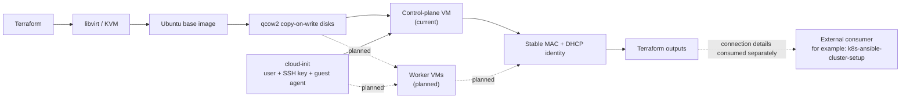

# Kubernetes Homelab Infrastructure on Libvirt

Terraform infrastructure for the virtual-machine layer of a personal Kubernetes
homelab. The project downloads an Ubuntu cloud image, creates an efficient
copy-on-write system disk, boots a UEFI virtual machine on KVM/libvirt, and
performs first-boot configuration with cloud-init.

> **Project status — Milestone 1 in progress:** the current configuration
> creates one Ubuntu VM intended to become the Kubernetes control-plane node.
> Multi-node provisioning is planned. The resulting nodes can later be
> configured by the separate `k8s-ansible-cluster-setup` project.

## What this project demonstrates

- Infrastructure as Code with Terraform and the libvirt provider
- KVM virtualization with UEFI, virtio storage, and virtio networking
- Efficient qcow2 disks backed by a shared Ubuntu base image
- Unattended first-boot configuration with cloud-init
- Key-only SSH access and a non-root sudo user
- Stable network identity through a fixed MAC address
- Parameterized compute, storage, networking, and image settings

## Project boundary

This repository owns the infrastructure lifecycle up to SSH-ready Ubuntu nodes:

- libvirt network attachment, storage, and VM lifecycle
- Ubuntu cloud-image provisioning
- copy-on-write system disks
- cloud-init first-boot configuration
- stable node network identity
- SSH readiness
- Terraform outputs

The companion `k8s-ansible-cluster-setup` repository owns everything performed inside
the nodes after first boot:

- operating-system configuration
- container runtime and Kubernetes packages
- `kubeadm` cluster bootstrap
- worker-node joining
- CNI, ingress, storage, monitoring, and security add-ons
- final cluster validation

Terraform does not install or bootstrap Kubernetes. It exposes infrastructure
facts; `k8s-ansible-cluster-setup` owns Ansible inventory construction, configuration
management, and the Kubernetes lifecycle.

## Architecture



The current implementation manages five resources:

1. A downloaded Ubuntu base volume.
2. A resizable qcow2 root volume backed by that image.
3. Rendered cloud-init data containing instance metadata and user
   configuration.
4. A libvirt volume containing the generated cloud-init ISO.
5. A running x86_64 KVM domain attached to the selected storage pool and
   virtual network.

The default libvirt network provides DHCP and outbound connectivity through
`virbr0`. The VM is not exposed directly on the physical LAN; inbound access
from other machines requires routing, port forwarding, or a bridged network.

## Prerequisites

- An x86_64 Linux host with hardware virtualization enabled
- QEMU/KVM, libvirt, and the `default` storage pool and network
- Permission to connect to `qemu:///system`
- Terraform 1.5 or newer
- An SSH public key

The VM uses the OVMF firmware path
`/usr/share/edk2/ovmf/OVMF_CODE.fd`. Adjust `main.tf` if your distribution
installs OVMF elsewhere.

## Quick start

```bash
cp terraform.tfvars.example terraform.tfvars
```

Review `terraform.tfvars` before provisioning. The repository defaults are the
author's real homelab values:

```hcl
vm_user            = "edoardo"
ssh_public_key_path = "~/.ssh/eagle_ed25519.pub"
```

The example variable file intentionally demonstrates how to override them.

Initialize Terraform, review the plan, and create the VM:

```bash
terraform init
terraform plan
terraform apply
```

Find the DHCP-assigned address:

```bash
virsh -c qemu:///system domifaddr k8s-control
```

Connect using the configured username:

```bash
ssh edoardo@<vm-ip>
```

If `terraform.tfvars` overrides `vm_user`, use that value instead. When
finished, remove the managed infrastructure:

```bash
terraform destroy
```

## Configuration

| Variable | Default | Purpose |
| --- | --- | --- |
| `libvirt_uri` | `qemu:///system` | Libvirt connection URI |
| `vm_name` | `k8s-control` | Domain and volume name prefix |
| `vm_user` | `edoardo` | Administrator created by cloud-init |
| `vm_vcpus` | `2` | Virtual CPU count |
| `vm_memory_mb` | `4096` | Memory in MiB |
| `root_disk_size_gib` | `40` | Root disk capacity in GiB |
| `libvirt_pool` | `default` | Existing storage pool |
| `libvirt_network` | `default` | Existing virtual network |
| `mac_address` | `52:54:00:12:34:56` | Stable VM network identity |
| `image_url` | Ubuntu 26.04 amd64 cloud image | Base operating-system image |
| `ssh_public_key_path` | `~/.ssh/eagle_ed25519.pub` | Public key installed in the VM |

The fixed MAC address is intentional. It preserves the node's network identity
across VM recreation and supports a deterministic DHCP lease or reservation.
The planned multi-node design will assign each node its own unique,
deterministic fixed MAC address.

See [`terraform.tfvars.example`](terraform.tfvars.example) for a minimal local
configuration. Usernames and paths to public SSH keys are configuration, not
secrets.

## Terraform outputs

The current outputs are:

| Output | Description |
| --- | --- |
| `vm_name` | Name of the created libvirt domain |
| `network_name` | Libvirt network attached to the VM |
| `mac_address` | Fixed MAC address assigned to the VM |
| `ssh_command` | SSH command template containing an `<vm-ip>` placeholder |

Inspect them after an apply:

```bash
terraform output
```

Node names, MAC addresses, discovered or reserved IP addresses, and per-node SSH
commands are planned outputs for the multi-node implementation. External tools
may consume these values independently.

## Terraform state

Terraform state and backups are excluded from Git. Local state is acceptable
for this personal homelab because execution is currently local and
single-operator. A remote backend may be introduced later if CI automation or
shared execution requires state locking and centralized storage.

State must still be treated carefully and reviewed for sensitive values before
it is copied, shared, or migrated.

## Repository layout

```text
.
├── main.tf                    # Volumes, cloud-init media, and VM domain
├── variables.tf               # Customizable infrastructure inputs
├── outputs.tf                 # VM identity and SSH helper output
├── versions.tf                # Terraform and provider constraints
├── cloud-init.yaml.tftpl      # First-boot guest configuration
├── terraform.tfvars.example   # Example local values
└── .gitignore                 # Local state and generated-file exclusions
```

## Roadmap

### Milestone 1 — Single-node foundation

- [x] Provision one Ubuntu control-plane VM on local libvirt/KVM
- [x] Create a reusable Ubuntu base image and copy-on-write root disk
- [x] Configure the user, SSH key, and QEMU guest agent with cloud-init
- [x] Preserve node network identity with a fixed MAC address
- [x] Expose the current VM, network, MAC, and SSH helper outputs

### Milestone 2 — Multi-node infrastructure

- [ ] Provision one control-plane node and a configurable number of workers
- [ ] Assign every node a unique, deterministic fixed MAC address
- [ ] Assign stable hostnames
- [ ] Provide deterministic DHCP leases or reservations
- [ ] Reuse copy-on-write disks backed by the shared base image

### Milestone 3 — Infrastructure outputs and orchestration

- [ ] Expose per-node infrastructure outputs
- [ ] Document output semantics
- [ ] Document how external configuration tools can consume the outputs
- [ ] Provide an optional external orchestration example

### Milestone 4 — Validation and CI

- [ ] Validate SSH readiness for all provisioned nodes
- [ ] Validate the resulting Kubernetes cluster through the external workflow
- [ ] Add Terraform formatting, validation, and plan checks in CI
- [ ] Add downloaded-image checksum verification
- [ ] Evaluate remote state for automated execution

## Security considerations

- Cloud-init configures key-only SSH access and disables password
  authentication.
- Private keys and credentials must never be committed to the repository.
- Public SSH-key paths and usernames are configuration values, not secrets.
- Terraform state can contain sensitive values and must remain excluded from
  Git and be reviewed before sharing.
- The Ubuntu image is currently downloaded directly from `image_url`; checksum
  verification is planned but not yet implemented.

## Known limitations

- The configuration currently creates one VM only.
- Networking uses the existing default libvirt NAT network.
- There are no per-node outputs for a multi-node topology yet.
- End-to-end Kubernetes installation and bootstrap are not implemented in this
  repository.
- The OVMF firmware path is distribution-specific.
- The current SSH output contains an IP-address placeholder rather than a
  discovered or reserved address.

## Design notes

Separating the base image from the root disk allows future nodes to reuse one
downloaded image without duplicating it. Each VM can receive its own resizable
copy-on-write disk while retaining a consistent operating-system baseline.

Stable network identity is equally important to the integration boundary:

```text
VM identity
  → stable fixed MAC address
  → stable DHCP lease or reservation
  → reliable SSH and Ansible targeting
```

Cloud-init keeps first-boot customization outside the image. Terraform outputs
describe the resulting infrastructure without depending on a specific
configuration-management tool. The separate `k8s-ansible-cluster-setup` project may
consume node connection details and owns inventory construction, configuration
management, and Kubernetes lifecycle operations.
