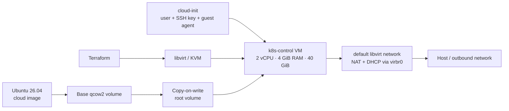

# Kubernetes Homelab on Libvirt

Terraform infrastructure for building a reproducible Kubernetes cluster on a
local KVM/libvirt host. The project starts at the virtualization layer: it
downloads an Ubuntu cloud image, creates a copy-on-write system disk, boots a
UEFI virtual machine, and configures secure SSH access automatically with
cloud-init.

> **Project status — foundation complete:** the current configuration creates
> one Ubuntu VM intended to become the Kubernetes control-plane node. Kubernetes
> installation, worker-node scaling, and cluster bootstrapping are the next
> phases.

## What this project demonstrates

- Infrastructure as Code with Terraform and the libvirt provider
- KVM virtualization with UEFI, virtio storage, and virtio networking
- Efficient qcow2 disks backed by a shared Ubuntu base image
- Unattended first-boot configuration with cloud-init
- Key-only SSH access and a non-root sudo user
- Parameterized compute, storage, networking, and image settings

## Architecture



Terraform manages four main resources:

1. A downloaded Ubuntu base volume.
2. A resizable qcow2 root volume backed by that image.
3. A cloud-init ISO containing instance metadata and user configuration.
4. A running x86_64 KVM domain attached to the selected storage pool and
   virtual network.

The default libvirt network provides DHCP and outbound connectivity. The VM is
not exposed directly on the physical LAN; inbound access from other machines
requires routing, port forwarding, or a bridged network.

## Prerequisites

- An x86_64 Linux host with hardware virtualization enabled
- QEMU/KVM, libvirt, and the `default` storage pool and network
- Permission to connect to `qemu:///system`
- Terraform 1.5 or newer
- An SSH public key

The VM uses the OVMF firmware path
`/usr/share/edk2/ovmf/OVMF_CODE.fd`. Adjust `main.tf` if your distribution
installs OVMF elsewhere.

## Quick start

```bash
cp terraform.tfvars.example terraform.tfvars
```

Edit `terraform.tfvars` to select your SSH key and username, then provision the
VM:

```bash
terraform init
terraform plan
terraform apply
```

Find the DHCP-assigned address:

```bash
virsh -c qemu:///system domifaddr k8s-control
```

Connect using the username configured in `terraform.tfvars`:

```bash
ssh ubuntu@<vm-ip>
```

When finished, remove the managed infrastructure:

```bash
terraform destroy
```

## Configuration

| Variable | Default | Purpose |
| --- | --- | --- |
| `libvirt_uri` | `qemu:///system` | Libvirt connection URI |
| `vm_name` | `k8s-control` | Domain and volume name prefix |
| `vm_user` | `edoardo` | Administrator created by cloud-init |
| `vm_vcpus` | `2` | Virtual CPU count |
| `vm_memory_mb` | `4096` | Memory in MiB |
| `root_disk_size_gib` | `40` | Root disk capacity in GiB |
| `libvirt_pool` | `default` | Existing storage pool |
| `libvirt_network` | `default` | Existing virtual network |
| `mac_address` | `52:54:00:12:34:56` | Stable VM MAC address |
| `image_url` | Ubuntu 26.04 amd64 cloud image | Base operating-system image |
| `ssh_public_key_path` | `~/.ssh/eagle_ed25519.pub` | Public key installed in the VM |

See [`terraform.tfvars.example`](terraform.tfvars.example) for a minimal local
configuration. Do not put private keys or other secrets in Terraform variables.

## Repository layout

```text
.
├── main.tf                    # Volumes, cloud-init media, and VM domain
├── variables.tf               # Customizable infrastructure inputs
├── outputs.tf                 # VM identity and SSH helper output
├── versions.tf                # Terraform and provider constraints
├── cloud-init.yaml.tftpl      # First-boot guest configuration
└── terraform.tfvars.example   # Example local values
```

## Roadmap

- [x] Provision an Ubuntu VM on local libvirt/KVM
- [x] Automate user, SSH key, and guest-agent configuration
- [x] Use a reusable cloud image and copy-on-write root disk
- [ ] Refactor the VM definition to create one control-plane and multiple workers
- [ ] Give every node deterministic addressing and hostnames
- [ ] Install the container runtime and Kubernetes packages
- [ ] Bootstrap the control plane with `kubeadm`
- [ ] Join worker nodes and install a CNI plugin
- [ ] Add validation, formatting, and plan checks in CI
- [ ] Move Terraform state out of the repository

## Design notes

The base image and root disk are separate so additional nodes can reuse the
downloaded image without duplicating it. A fixed MAC address makes DHCP
reservations possible, while cloud-init keeps guest customization outside the
image. These choices prepare the project for turning the single-VM foundation
into a repeatable multi-node cluster.
