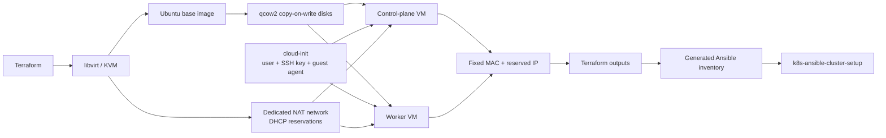

# Kubernetes Homelab Infrastructure on Libvirt

[](https://github.com/edimatt/k8s-terraform-cluster-setup/actions/workflows/terraform-ci.yml)

Terraform infrastructure for the virtual-machine layer of a personal Kubernetes
homelab. The project downloads an Ubuntu cloud image, creates an efficient
copy-on-write system disk, boots a UEFI virtual machine on KVM/libvirt, and
performs first-boot configuration with cloud-init.

## Continuous integration

GitHub Actions checks Terraform formatting, provider initialization without a
backend, and Terraform configuration validation on pull requests and pushes to
`main`. It does not provision or modify libvirt infrastructure.

> **Project status — two-node lab:** the current configuration creates one
> Kubernetes control-plane VM and one worker VM. The resulting nodes can later
> be configured by the separate `k8s-ansible-cluster-setup` project.

## What this project demonstrates

- Infrastructure as Code with Terraform and the libvirt provider
- KVM virtualization with UEFI, virtio storage, and virtio networking
- Efficient qcow2 disks backed by a shared Ubuntu base image
- Unattended first-boot configuration with cloud-init
- Key-only SSH access and a non-root sudo user
- Dedicated Terraform-managed NAT network
- Stable network identity through fixed MAC and DHCP reservations
- DHCP lease-based IP discovery and generated Ansible inventory
- Parameterized compute, storage, networking, and image settings

## Project boundary

This repository owns the infrastructure lifecycle up to SSH-ready Ubuntu nodes:

- dedicated libvirt NAT network, storage, and VM lifecycle
- Ubuntu cloud-image provisioning
- copy-on-write system disks
- cloud-init first-boot configuration
- stable node network identity
- SSH readiness
- Terraform outputs, including an Ansible inventory

The companion `k8s-ansible-cluster-setup` repository owns everything performed inside
the nodes after first boot:

- operating-system configuration
- container runtime and Kubernetes packages
- `kubeadm` cluster bootstrap
- worker-node joining
- CNI, ingress, storage, monitoring, and security add-ons
- final cluster validation

Terraform does not install or bootstrap Kubernetes. It exposes infrastructure
facts and renders the inventory; `k8s-ansible-cluster-setup` owns configuration
management and the Kubernetes lifecycle.

## Architecture



The current implementation manages ten resource instances:

1. A dedicated NAT network with DHCP reservations.
2. A downloaded Ubuntu base volume.
3. Two resizable qcow2 root volumes backed by that shared image.
4. Two rendered cloud-init disks containing per-node instance metadata and
   shared user configuration.
5. Two libvirt volumes containing the generated cloud-init ISOs.
6. Two running x86_64 KVM domains attached to the selected storage pool and
   virtual network.

The dedicated `k8s-lab` network defaults to `192.168.125.0/24`, provides
outbound connectivity through NAT, and reserves `.10` for the control plane and
`.11` for the worker. Dynamic DHCP clients use `.100` through `.254`. The VMs
are not exposed directly on the physical LAN; inbound access from other
machines requires routing, port forwarding, or a bridged network. Terraform
queries each domain's libvirt DHCP lease and reports whether it matches the
reservation used in the generated inventory.

## Prerequisites

- An x86_64 Linux host with hardware virtualization enabled
- QEMU/KVM, libvirt, and the `default` storage pool
- Permission to connect to `qemu:///system`
- Terraform 1.5 or newer
- An SSH public key

The VM uses the OVMF firmware path
`/usr/share/edk2/ovmf/OVMF_CODE.fd`. Adjust `main.tf` if your distribution
installs OVMF elsewhere.

## Quick start

```bash
cp terraform.tfvars.example terraform.tfvars
```

Review `terraform.tfvars` before provisioning. The repository defaults are the
author's real homelab values:

```hcl
vm_user            = "edoardo"
ssh_public_key_path = "~/.ssh/eagle_ed25519.pub"
```

The example variable file intentionally demonstrates how to override them.

Initialize Terraform, review the plan, and create the VMs:

```bash
terraform init
terraform plan
terraform apply
```

Print the generated inventory after provisioning:

```bash
terraform output -raw ansible_inventory
```

The default inventory is:

```ini
[kube_control_plane]
k8s-control ansible_host=192.168.125.10

[kube_node]
k8s-worker ansible_host=192.168.125.11

[k8s_cluster:children]
kube_control_plane
kube_node

[all:vars]
ansible_user=edoardo
ansible_python_interpreter=/usr/bin/python3
```

The username follows `vm_user`. Export the inventory for Ansible:

```bash
terraform output -raw ansible_inventory > inventory.ini
```

Inspect the reserved addresses and DHCP lease verification:

```bash
terraform output nodes
```

Print the control-plane SSH command:

```bash
terraform output -raw ssh_command
```

When finished, remove the managed infrastructure:

```bash
terraform destroy
```

## Configuration

| Variable | Default | Purpose |
| --- | --- | --- |
| `libvirt_uri` | `qemu:///system` | Libvirt connection URI |
| `vm_name` | `k8s-control` | Control-plane domain and volume name prefix |
| `vm_user` | `edoardo` | Administrator created by cloud-init |
| `vm_vcpus` | `2` | Control-plane virtual CPU count |
| `vm_memory_mb` | `4096` | Control-plane memory in MiB |
| `root_disk_size_gib` | `40` | Control-plane root disk capacity in GiB |
| `worker_name` | `k8s-worker` | Worker domain and volume name prefix |
| `worker_vcpus` | `2` | Worker virtual CPU count |
| `worker_memory_mb` | `4096` | Worker memory in MiB |
| `worker_root_disk_size_gib` | `40` | Worker root disk capacity in GiB |
| `libvirt_pool` | `default` | Existing storage pool |
| `libvirt_network` | `k8s-lab` | Dedicated network name |
| `libvirt_network_cidr` | `192.168.125.0/24` | Dedicated network subnet |
| `libvirt_dhcp_start_host` | `100` | Dynamic DHCP pool start host |
| `libvirt_dhcp_end_host` | `254` | Dynamic DHCP pool end host |
| `mac_address` | `52:54:00:12:34:56` | Stable control-plane network identity |
| `control_plane_ip_host` | `10` | Reserved control-plane host number |
| `worker_mac_address` | `52:54:00:12:34:57` | Stable worker network identity |
| `worker_ip_host` | `11` | Reserved worker host number |
| `image_url` | Ubuntu 26.04 amd64 cloud image | Base operating-system image |
| `ssh_public_key_path` | `~/.ssh/eagle_ed25519.pub` | Public key installed in the VM |

The fixed, unique MAC addresses and reservations preserve the nodes' IP
addresses across VM recreation. Reservation host numbers must remain outside
the dynamic DHCP pool.

See [`terraform.tfvars.example`](terraform.tfvars.example) for a minimal local
configuration. Usernames and paths to public SSH keys are configuration, not
secrets.

## Dedicated network and reservations

Terraform creates the network rather than attaching the nodes to libvirt's
shared `default` network. With the defaults, the resulting address plan is:

| Purpose | Address or range |
| --- | --- |
| Network | `192.168.125.0/24` |
| Gateway | `192.168.125.1` |
| Control-plane reservation | `192.168.125.10` |
| Worker reservation | `192.168.125.11` |
| Dynamic DHCP pool | `192.168.125.100`–`192.168.125.254` |

Reservations are generated from the stable node definitions:

```text
control_plane: 52:54:00:12:34:56 → 192.168.125.10
worker:        52:54:00:12:34:57 → 192.168.125.11
```

The gateway is host number `1`. Node addresses and the dynamic range are
calculated with `cidrhost`, so changing `libvirt_network_cidr` moves the entire
address plan to the new subnet. Terraform checks that node names, MAC
addresses, and reservations are unique and that reservations remain outside
the dynamic pool.

Before choosing another CIDR, ensure that it does not overlap the host LAN,
VPNs, container networks, or other libvirt networks.

## Terraform outputs

The main outputs are:

| Output | Description |
| --- | --- |
| `vm_name` | Name of the created libvirt domain |
| `network_name` | Libvirt network attached to the VM |
| `mac_address` | Fixed MAC address assigned to the VM |
| `ssh_command` | SSH command using the reserved control-plane address |
| `nodes` | Names, roles, reserved IPs, discovered leases, and verification |
| `ansible_inventory` | Complete two-node Ansible inventory |

Inspect every output:

```bash
terraform output
```

Print or export the inventory without Terraform's string quoting:

```bash
terraform output -raw ansible_inventory
terraform output -raw ansible_inventory > inventory.ini
```

Each entry in `nodes` includes:

- `ip_address` and `reserved_ip`: the deterministic Terraform-managed address;
- `discovered_ip_address`: the current address reported by the libvirt DHCP
  lease data source;
- `lease_verified`: whether the discovered lease matches the reservation.

## Network verification

Inspect the managed network definition and its active leases:

```bash
virsh -c qemu:///system net-dumpxml k8s-lab
virsh -c qemu:///system net-dhcp-leases k8s-lab
```

Inspect the address associated with each domain:

```bash
virsh -c qemu:///system domifaddr k8s-control --source lease
virsh -c qemu:///system domifaddr k8s-worker --source lease
```

The expected addresses are `.10` and `.11`. Unlike unrestricted dynamic
leases, these addresses remain stable when the VMs are recreated because DHCP
maps each fixed MAC address to its Terraform-managed reservation.

## Terraform state

Terraform state and backups are excluded from Git. Local state is acceptable
for this personal homelab because execution is currently local and
single-operator. A remote backend may be introduced later if CI automation or
shared execution requires state locking and centralized storage.

State must still be treated carefully and reviewed for sensitive values before
it is copied, shared, or migrated.

## Repository layout

```text
.
├── main.tf                    # Volumes, cloud-init media, and VM domain
├── variables.tf               # Customizable infrastructure inputs
├── outputs.tf                 # Node details and generated Ansible inventory
├── versions.tf                # Terraform and provider constraints
├── cloud-init.yaml.tftpl      # First-boot guest configuration
├── terraform.tfvars.example   # Example local values
└── .gitignore                 # Local state and generated-file exclusions
```

## Roadmap

### Milestone 1 — Single-node foundation

- [x] Provision one Ubuntu control-plane VM on local libvirt/KVM
- [x] Create a reusable Ubuntu base image and copy-on-write root disk
- [x] Configure the user, SSH key, and QEMU guest agent with cloud-init
- [x] Preserve node network identity with a fixed MAC address
- [x] Expose the current VM, network, MAC, and SSH helper outputs

### Milestone 2 — Multi-node infrastructure

- [x] Provision one control-plane node and one worker
- [x] Assign every node a unique, deterministic fixed MAC address
- [x] Assign stable hostnames
- [x] Manage a dedicated NAT network and DHCP reservations
- [x] Verify reserved addresses through libvirt DHCP leases
- [x] Reuse copy-on-write disks backed by the shared base image

### Milestone 3 — Infrastructure outputs and orchestration

- [x] Expose per-node infrastructure outputs
- [x] Generate an Ansible inventory output
- [x] Document output semantics
- [x] Document how external configuration tools can consume the outputs

### Milestone 4 — Validation and CI

- [ ] Validate SSH readiness for all provisioned nodes
- [ ] Validate the resulting Kubernetes cluster through the external workflow
- [ ] Add Terraform formatting, validation, and plan checks in CI
- [ ] Add downloaded-image checksum verification
- [ ] Evaluate remote state for automated execution

## Security considerations

- Cloud-init configures key-only SSH access and disables password
  authentication.
- Private keys and credentials must never be committed to the repository.
- Public SSH-key paths and usernames are configuration values, not secrets.
- Terraform state can contain sensitive values and must remain excluded from
  Git and be reviewed before sharing.
- The Ubuntu image is currently downloaded directly from `image_url`; checksum
  verification is planned but not yet implemented.

## Known limitations

- DHCP lease discovery is evaluated during apply. If the selected network does
  not yet expose the reserved leases, `discovered_ip_address` can initially be
  empty and `lease_verified` false. The inventory and SSH output use the
  Terraform-managed reservations and are not blocked by this provider timing.
  After the leases appear, refresh the verification fields without modifying
  infrastructure:

  ```bash
  terraform apply -refresh-only
  ```

- End-to-end Kubernetes installation and bootstrap are not implemented in this
  repository.
- The OVMF firmware path is distribution-specific.

## Design notes

Separating the base image from the root disk allows future nodes to reuse one
downloaded image without duplicating it. Each VM can receive its own resizable
copy-on-write disk while retaining a consistent operating-system baseline.

Stable network identity is equally important to the integration boundary:

```text
VM identity
  → stable fixed MAC address
  → Terraform-managed DHCP reservation
  → reliable SSH and Ansible targeting
```

Cloud-init keeps first-boot customization outside the image. Terraform outputs
describe the resulting infrastructure and generate the Ansible inventory. The
separate `k8s-ansible-cluster-setup` project consumes that inventory and owns
configuration management and the Kubernetes lifecycle.
